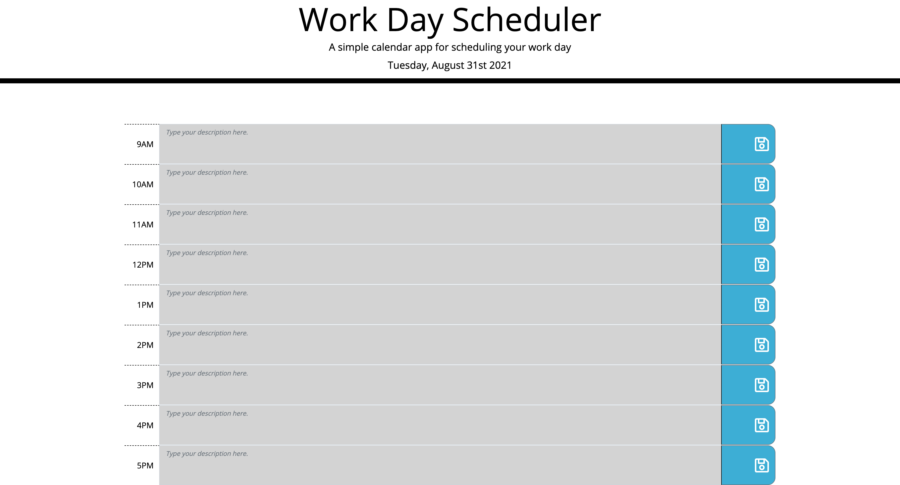

# Work Day Scheduler

## Purpose

Using jQuery create a work schedule by hour.

## Built With

- Javascript
- HTML & CSS
- jQuery
- Bootstrap 5
- localStorages

## Third Party API

- Bootstrap 5.0: Layout and Modal Component
- jQuery 3.4
- Momenth js

## Website

https://joseduardo15062005.github.io/Work-Day-Scheduler/

## Contribution

Made with ❤️ by [joseduardo]
